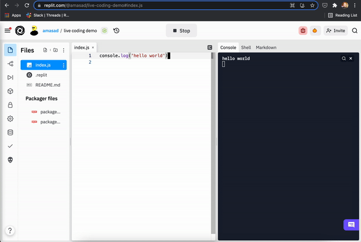

## Live Coding in Node.js

Never click run again! Just write your code and it will reevaluate for you.

This template is similar to a regular node repl except it re-runs your code on a regular interval. This makes it really fun for quick prototyping, for data-crunching, or for demos. 

Simply hit run and start coding!